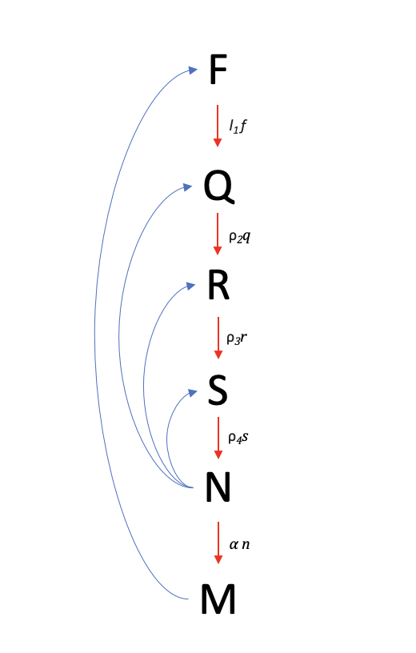

```{r setup, include=FALSE}
knitr::opts_chunk$set(echo = TRUE, warning = FALSE, message=FALSE)
```

\pagebreak

\tableofcontents

\pagebreak

# Afkortingen 

* Tumorsuppresorgen (TSG)
* Verlies van heterozygositeit (LOH)

\pagebreak


# Introductie

Borstkanker is een van de meest voorkomende kankers (*Cancer Statistics, 2020*). Jaarlijks sterven hier duizenden mensen aan. Kanker ontstaat door fouten in kankergerelateerde genen. Deze genen zijn respectievelijk oncogenen en tumorsuppressorgenen (TSG). Oncogenen zorgen voor regulatie van celgroei en celdeling. Tumorsuppressorgenen zorgen (normaal gesproken) voor remming van ongecontroleerde celgroei. Bij fouten in deze genen kan er dus een kanker ontstaan. Vaak zijn vier tot zes mutaties al genoeg om een kanker te ontwikkelen. 

Voor elk gen heb je twee kopieën (allelen) dus voor bijvoorbeeld het TSG p53 heb je twee identieke sequenties. Normaal gesproken zijn deze TSG's homozygoot recessief na één mutatie zal de functie niet meteen veranderen, je hebt namelijk nog het originele wild-type kopie en deze kan de functie van ongecontroleerde celgroei in goede banen leiden. Echter, wanneer er twee mutaties optreden, zal de onderdrukking volledig wegvallen. Dit zorgt voor een verlies van heterozygositeit (LOH), LOH is belangrijk in de ontwikkeling van de beginfase van borstkanker.

&nbsp;

Borstkanker is vandaag de dag goed te behandelen. Dit komt doordat de kanker vaak in een vroeg stadium wordt ontdekt door screening (*Reeves, 2023*). Er zijn ook in de loop van de jaren vele behandeltechnieken ontwikkeld om deze soort(en) van kanker te verwijderen. Zo vindt er bijvoorbeeld tegenwoordig ook niet meteen mammectomie (borstverwijdering) plaats.

Elke behandeling heeft natuurlijk voor- en nadelen. Het is daarom belangrijk om te weten welke behandeling geschikt is. In dit verslag zal er een onderzoek (*Enderling et al., 2007*) gereproduceerd worden. Dit onderzoek gaat over de (lokale) behandeling van borstkanker en een eventuele hernieuwde aanval (recidief).

## Doel

Het doel van dit onderzoek is om meer inzichten te geven in borstkanker. En dan in het speciaal de ontwikkeling van een tumor na een behandeling. Er zullen zes wiskundige vergelijkingen gebruikt worden. Uit de modulatie van deze vergelijkingen komen verlopen van verschillende situaties, aan de hand hiervan kunnen de inzichten gegeven worden en dus het doel van het onderzoek bereiken.

Het doel van de modellen is om te laten zien hoe de toename van LOH invloed heeft op de vermindering van gezonde borst-stamcellen en dat deze verandering direct kan leiden tot tumorvorming. Dit wordt gedaan aan de hand van twee visualisatie methodes; Eén vanuit een nul dimensionale berekening en de ander vanuit een één dimensionale berekening. 

&nbsp;

De verwachting voor de modellen ziet er als volgt uit. De hoeveelheid gezonde borst-stamcellen (f) naar verloop van tijd steeds sneller zal afnemen. De aanwezigheid van LOH op TSG1 en TSG2 (q, s) steeds meer toeneemt. Naar onze verwachting zal de concentratie uitgeschakelde TSG's (r) dan ook steeds meer toenemen. Door de toenemende hoeveelheid inactieve cellen verwachten we dat de hoeveelheid tumorcellen (n) naar verloop van tijd zal toenemen. Hoe meer tumorcellen hoe meer enzymen er gemaakt kunnen worden, de concentratie geproduceerde MDE's (m) zal dus ook toenemen.  

\pagebreak

## Theorie

Op basis van zes verschillende formules kan de invloed op de ontwikkeling van tumoren in de borst na een behandeling worden gesimuleerd. Het model kan met de volgende citaat uit het artikel (*Enderling et al., 2007*) worden toegelicht: "*Tomlinson (2001) presented a more specific model in which the mutation of two TSG's and three oncogenes was necessary to form a tumour cell. We will adapt this approach and for simplicity assume that mutations in two TSG's are sufficient to give rise to a tumour.*". In de onderstaande formules wordt deze assumptie uitgebeeld met genen TSG1 en TSG2. Dit is terug te zien aan het feit dat de genen van heterozygoot (+/-) en werkend als tumor suppressor gen gaan naar homozygoot recessief (-/-), waar de inhibitoire functie uitstaat. Elke opeenvolgende vergelijking beschrijft dus het gevolg van de mutaties in de twee TSG's op de rest van het biologische model.

Hieronder zal allereerst een eenvoudige grafische weergave van het model worden getoond. In deze afbeelding worden alle initiële waardes getoond. Hiernaast zijn enkele parameters geplaatst die volgens ons belangrijk zijn in het verloop.

```{r, echo=FALSE, out.width='95%', fig.cap="Grafische weergave van het model. De blauwe lijnen geven de invloed van de initiële waardes aan."}

```

&nbsp;

Ten eerste wordt de fractie in verandering van borstweefsel berekend, met gezonde borst-stamcellen over de verandering in tijd (f). Het linker deel bepaald de afbraak van stamcellen. Het rechter gedeelte is de hoeveelheid stamcellen in verhouding met het aantal TSG's dat afhankelijk is van de mutatie waarschijnlijk in een normale situatie. 

$$\frac{df}{dt} = - \overbrace{{\eta}_f mf}^{afbraak} - \overbrace{l_{1}f}^{f{\rightarrow}TSG{_1}^{+/-}}$$

Verder kunnen TSG's heterozygositeit verliezen door mutaties. Het gen staat aan bij (++) of (+-), maar TSG's gaan uit, wanneer zo homozygoot (--) worden.
De volgende formule beschrijft deze verandering over de verandering van tijd. De vermeerdering van deze cellen staat links onder 'proliferation' (vermeerdering) en deze hoeveelheid neemt af door celapoptose onder 'death' (dood). 

Hier worden stamcellen bij opgeteld die gemuteerd zijn over één jaar tijd. Deze hoeveelheid neemt af door het tempo van de mutaties die plaats vinden. Het tempo is afhankelijk van de kans dat mutaties zullen optreden. De verandering van deze aanwezigheid van LOH op TSG1's wordt aangegeven met (q).

$$\frac{dq}{dt} = \overbrace{{\lambda}_{q}q(1 - A)}^{proliferatie} - \overbrace{{\eta}_{q}nq}^{celdood}  + \overbrace{l_{1}f}^{f{\rightarrow}TSG_{1}^{+/-}} - \overbrace{{\rho}_{2}q}^{TSG1_{1}^{+/-} {\rightarrow}TSG_{1}^{-/-}}$$  


De derde formule beschrijft de verandering van de concentratie in uitgeschakelde $TSG_{1}$ (r) over verloop van tijd. Eerst wordt de aanmaak en vermeerdering berekend minus de afbraak door celdood. 

$$\frac{dr}{dt} = \overbrace{{\lambda}_{q}r(1 - A)}^{proliferatie} - \overbrace{{\eta}_{r}nr}^{celdood}  + \overbrace{{\rho}_{2}q}^{TSG_{1}^{+/-}{\rightarrow}TSG_{1}^{-/-}} - \overbrace{{\rho}_{3}r}^{TSG1_{1}^{-/-} {\rightarrow}TSG_{2}^{+/-}}$$ 

In de vierde formule wordt de verandering berekend van de hoeveelheid LOH op $TSG_2$ (s), de tweede tumor suppressor gen die van heterozygoot naar homozygoot recessief gaat. Deze verandering wordt gezet tegen de verandering in tijd.

$$\frac{ds}{dt} = \overbrace{{\lambda}_{s}s(1 - A)}^{proliferatie} - \overbrace{{\eta}_{r}ns}^{celdood}  + \overbrace{{\rho}_{3}r}^{TSG1_{1}^{-/-} {\rightarrow}TSG_{2}^{+/-}} - \overbrace{{\rho}_{4}s}^{TSG_{2}^{+/-} {\rightarrow} n}$$

&nbsp;

Vervolgens wordt de partiële afgeleide genomen van de verandering in tumorcel dichtheid (n) dat afhankelijk is van de partiële afgeleide van de verandering in tijd (t).

$$\frac{\partial n}{\partial t} = \overbrace{{\lambda}_{n}n(1 - A)}^{proliferatie} + \overbrace{d_{n}\nabla^2n}^{willekeurige\\beweging}  - \overbrace{\gamma \nabla . (n \nabla f)}^{haptotaxis} - \overbrace{{\rho}_{4}s}^{TSG_{2}^{+/-} {\rightarrow}n}$$


De laatste formule beschrijft de partiële afgeleide van de verandering in de hoeveelheid enzymen (MDE's) die door tumoren geproduceerd worden (m) tegen de partiële afgeleide van de verandering tijd (t).

$$\frac{\partial m}{\partial t} = \overbrace{d_m{\nabla}^2{m}}^{diffusie} + \overbrace{{\alpha}n(1-m)}^{productie} - \overbrace{{\beta}m}^{verval}$$

&nbsp;


Verder wordt in het artikel de volgende situatie aangenomen. Borstgroei begint ongeveer rond twaalf jaar oud en op ongeveer twintig jaar oud is een borst volgroeid. Omdat f0 het beginhoeveelheid geeft van gezonde borst-stamcellen, moet er dus ook de goede t0 gekozen worden. Dit betekent dat de aanname voor f0 begint op tijd is twaalf jaar.

# Methoden

## Het software model

In dit hoofdstuk zijn de gebruikte pakketten en functies beschreven, die nodig zijn om het biologische model te simuleren.

Er worden twee libraries gebruikt. Ten eerste deSolve (versie 1.35) voor de functie ODE en ODE.1D. Pracma (versie 2.3.3) wordt gebruikt om te kunnen partieel differentiëren bij de ODE.1D functie. Het modelleren wordt gedaan in R (versie 4.2.2).

```{r}
library(deSolve)
library(pracma)
```

&nbsp;

### Differentiaal vergelijkingen in nul dimensies

De onderstaande functie ontvangt alle parameters beschreven in hoofdstuk Model Configuratie. Vervolgens worden alle vergelijkingen berekend en geretourneerd in een lijst.

```{r}
verandering.0D <- function (time, parameters, initial.values) {
  with(as.list(c(parameters, initial.values)),{
    A <- n+f+q+r+s
    # Vergelijkingen
    df.dt <- - (nf * m * f) - (L1 * f)
    dq.dt <- (lambda.q * q * (1 - A)) - (nq * n * q) + (L1 * f) - (p2 * q)
    dr.dt <- (lambda.r * r * (1 - A)) - (nr * n * r) + (p2 * q) - (p3 * r)
    ds.dt <- (lambda.s * s * (1 - A)) - (ns * n * s) + (p3 * r) - (p4 * s)
    d.accent.n.dt <- (lambda.n * n * (1 - A)) + (dn * x) - 
      (y * x * (n * x * f)) + (p4 * s)
    d.accent.m.dt <- (dm * x) + (alfa * n * (1 - m)) - (b * m)
    

    # Retourneren van de initiële waardes
    return(list(c(df.dt, dq.dt, dr.dt, ds.dt, d.accent.n.dt, d.accent.m.dt)))
  })
}
```

\pagebreak

### Differentiaal vergelijkingen in één dimensie

In de onderstaande functie worden de vergelijkingen uitgewerkt met de ODE-functie. Echter, in het gekozen artikel worden de vergelijkingen opgelost door middel van partieel differentiëren. Dit is de juiste methode om de grafieken van het artikel te reproduceren. Hoewel dit buiten ons vizier valt, is hier toch naar gekeken. 

Om de vergelijkingen op te lossen op deze manier (partieel differentiëren), worden 100 punten gebruikt voor elke initiële waarde. In het artikel (*Enderling et al., 2007*) worden bij figuur vier en vijf het verloop getoond bij t = 0. Er is te zien dat er al een verloop zichtbaar is. D.w.z., de initiële waardes moeten worden aangepast binnen deze 100 specifieke punten.

&nbsp;

De ODE.1D functie wordt gebruikt om deze vergelijkingen in één dimensie op te lossen. Voor elke initiële waarde, worden 100 differentiaalvergelijkingen opgelost.

Al deze waardes kunnen worden gevisualiseerd op een specifiek tijdstip. Je hebt zo dus respectievelijk de tijd, de index van alle differentiaalvergelijkingen en de waardes van deze punten. Er worden drie dimensies weergegeven in twee dimensionaal figuur. 

```{r}
verandering.1D <- function (time, initial.values, parameters) {
  with(as.list(c(parameters, initial.values)),{
    
    # Het uitpakken van de variabelen voor de vergelijkingen
    f <- initial.values[1:N]
    q <- initial.values[(N+1):(2*N)]
    r <- initial.values[(2*N+1):(3*N)]
    s <- initial.values[(3*N+1):(4*N)]
    n <- initial.values[(4*N+1):(5*N)]
    m <- initial.values[(5*N+1):(6*N)]
    
    # Aantal punten voor initiële waardes
    N <- 100
    
    # Het berekenen van A
    A <- n+f+q+r+s
    
    # Vergelijkingen
    df.dt <- - (nf * m * f) - (L1 * f)
    dq.dt <- (lambda.q * q * (1 - A)) - (nq * n * q) + (L1 * f) - (p2 * q)
    dr.dt <- (lambda.r * r * (1 - A)) - (nr * n * r) + (p2 * q) - (p3 * r)
    ds.dt <- (lambda.s * s * (1 - A)) - (ns * n * s) + (p3 * r) - (p4 * s)
    d.accent.n.dt <- (lambda.n * n * (1 - A)) + (dn * 
                                gradient(gradient(n, h1 = 1/N), h1 = 1/N)) - 
      (y * gradient(n * gradient(f, h1 = 1/N), h1 = 1 / N)) + (p4 * s)
    d.accent.m.dt <- (dm * gradient(gradient(m, h1 = 1/N), h1 = 1/N)) + 
      (alfa * n * (1 - m)) - (b * m)
    
    # Retourneren van de initiële waardes
    return(list(as.double(c(df.dt, dq.dt, dr.dt, ds.dt, 
                            d.accent.n.dt, d.accent.m.dt))))
  })
}
```

## Model configuratie

In dit hoofdstuk worden alle variabelen beschreven uit het biologische model. Deze data is genormaliseerd door de parameters $f, q, r, s, n, m, x, t$ te delen door hun beginwaardes e.g. $(\frac{f}{f_0})$. De parameter $f$ heeft de eenheid molair $M$. De overige parameters hebben geen eenheden en zijn dus eenheidsloos.

Doordat de afgeleiden van alle parameters op nul zijn gezet, dus $x$ wordt op nul gezet. Er wordt alleen gekeken naar de situatie op een horizontale lijn, want de lijn van de afgeleide in nul is in een grafiek horizontaal. Daartegenover wordt in het artikel gekeken naar het verloop bij meerdere afgeleiden.

&nbsp;

Ten eerste wordt de dood van cellen als gevolg van milieuacidose veroorzaakt door kankercellen genoteerd als $n_x$.
De hoeveelheid enzymen die door de tumoren worden aangemaakt is met m en de hoeveelheid tumor cellen is n.
Verder zijn cellen met LOH in $TSG_1$ q en cellen met LOH in $TSG_2$ zijn s. Geïnactiveerd $TSG_1$ is r en
de kans dat een allel van een normale cel muteert, is p. De totale weefsel en cel populatie, inclusief kanker cellen heet A.

De borst weefsel met een fractie gezonde borst-stamcellen heet f en de mutatiesnelheid van deze gezonde borst-stamcellen ($TSG_1^{+/+}$ & $TSG_2^{+/+}$) naar cellen
met LOH op TSG2 wordt beschreven als ${\lambda}q$. Tevens is ${\lambda}r$ de mutatiesnelheid van gezonde borst-stamcellen ($TSG_1^{+/+}$ & $TSG_2^{+/+}$) naar cellen met LOH op TSG1 en TSG2.
${\lambda}s$ geeft de mutatiesnelheid van gezonde borst-stamcellen ($TSG_1^{+/+}$ & $TSG_2^{+/+}$) naar cellen met LOH op TSG1, TSG2. De groeisnelheid van tumor cellen wordt aangegeven met ${\lambda}n$. 

&nbsp;

Vervolgens wordt de spontane beweging van normale cellen door $d_n$ bepaald en de spontane beweging van een kanker cel door $d_m$.
Theta is het product van de mutatie kans, het percentage stam cellen en aantal TSG's. Het artikel (*Enderling et al., 2007*) stelt dat ${\beta}$ een decay factor dat te betrokken is bij de afbraak van MDE's.
Verder is ${\alpha}$ de productie factor betrokken bij de aanmaak van tumorcellen en ${\gamma}$ is een factor betrokken bij de rate van de uitgroei van tumorcellen.

### Parameters dimensieloos 

```{r}
# Parameters

parameters.0D <- c(
  lambda.n = 0.75, lambda.q = 7.5e-3, lambda.r = 7.575e-3, lambda.s = 0.0375,
  nf = 1, nq = 0.5, nr = 0.5, ns = 0.5,
  L1 = (1 * (0.05 * 50 * 2e-7)),
  dm = 0.0005, dn = 0.0001,
  p1 = 2e-7, p2 = 5e-6, p3 = 1e-3, p4 = 3e-2,
  y = 0.00005, b = 0, nabla = 0, alfa = 0.1,
  x = 0)

# Tijdssequentie
times.0D <- 12:90

# Initiële waardes
initial.values.0D <- c(f = 1e-11, q = 0, r = 0, s = 0, n = 0, m = 0)
```

Het artikel (*Enderling et al., 2007*) stelt dat vanaf ongeveer twaalf jaar borst-stamcellen ontwikkelen en wordt er dan aangenomen dat er dan ook LOH's kunnen voorkomen. Daarom wordt in hoofdstuk "Model Configuratie" een tijdsequentie genomen van twaalf tot negentig jaar voor een mooie schaalverdeling.

\pagebreak

### Parameters één dimensie

Experimentele parameters voor de ODE.1D simulatie.

```{r}
# Parameters
parameters.1D <- c(
  lambda.n = 0.75, lambda.q = 7.5e-3, lambda.r = 7.575e-3, lambda.s = 0.0375,
  nf = 1, nq = 0.5, nr = 0.5, ns = 0.5,
  L1 = 0.000365,
  dm = 5.1e-12, dn = 1e-9,
  p1 = 2e-7, p2 = 5e-6, p3 = 1e-3, p4 = 1e-2,
  y = 0.00005, b = 0, nabla = 0, alfa = 1.01,
  x = 0)

# Tijdssequentie
times.1D <- 0:80

# Aantal punten initiële waardes
N <- 100

# Initiële waardes
initial.values.1D <- rep(c(f = 0.75, q = 0, r = 0, s = 0, n = 0, m = 0), 
                         each = N)
```

```{r}
for (i in seq((5.5/14*100), (8.5/14*100), 1)) {
  # f initiële waarde van f aanpassen op specifieke punten
  initial.values.1D[round(i)] = 0.72
  # q initiële waarde van f aanpassen op specifieke punten
  initial.values.1D[round(i) + 100] = 0.05
}
```

\pagebreak

# Resultaten

## Nul dimensionaal

De ODE-functie simuleert nul dimensionaal de veranderingen in het biologische model voor één tijdspunt.

```{r}
out.0D <- ode(y = initial.values.0D, times = times.0D, func = verandering.0D, 
              parms = parameters.0D)
```

De onderstaande grafieken zijn gemaakt op een nul dimensionale berekening van het biologische model. Dit betekent dat de afgeleiden gelijk zijn aan nul en dus maar op één tijdspunt de veranderingen worden vergeleken. Want bij partieel differentiëren wordt een functie gepakt met een aantal variabelen en worden per initiële waarde punten vergeleken. Tevens wordt onder het kopje ODE.1D het verloop berekend voor honderd keer per initiële waarde, zoals besproken is in hoofdstuk "Differentiaal vergelijkingen in één dimensie.

```{r, fig.cap="**In dit figuur worden zes verlopen geplot respectievelijk, zoals de letters uit de titels zijn beschreven in hoofdstuk Theorie. De plots worden berekend bij een afgeleide van nul. In alle grafieken is op de y-as de hoeveelheid stof te zien en dit verloopt over de x-as met elke tijdseenheid is één jaar. In grafiek f begint bij t~60 de hoeveelheid borst-stamcellen af te nemen tot t ~ 74 richting y = 0. Verder loopt als gevolg van het verloop in grafiek f in grafiek (q) de hoeveelheid LOH's (bijna) exponentieel op van t ~ 0 richting t ~ 65. Deze hoeveelheid loopt vanaf jaar ~ 65 vervolgens weer af richting nul. Door de aanwezigheid van LOH op TSG1 wordt TSG1 uitgeschakeld. In grafiek r correspondeert het verloop van grafiek r met het verloop van grafiek q. Alleen loopt dit proces minder snel op. In grafiek s verloopt de aanwezigheid LOH op TSG2 relatief langzaam tot wederom t~65 en deze hoeveelheid neemt vervolgens fors af. In grafieken f, q, r, en s verlopen de afnames fors af tot t~80 richting y = 0. \\linebreak \\linebreak  Grafieken n en m tonen oorzaak en gevolg van elkaar. Want het aantal tumorcellen in grafiek n vanaf t ~ 62 neemt fors toe en deze tumorcellen maken MDE-enzymen om ruimte vrij te maken voor nieuwe tumorcellen. Dus in grafiek m zal vanaf t ~ 62 ook het aantal MDE's respectievelijk fors toenemen tot y ~ 10.0, waar er een evenwicht wordt bereikt.**"}
par("mar"=c(5, 4, 4, 4))
plot(out.0D, main = c("Verloop F", "Verloop Q",
                   "Verloop R", "Verloop S",
                   "Verloop N", "Verloop M"),
     xlab = "Tijd (jaren)", ylab = "Hoeveelheid van stof", col = "blue")
```

In figuur 4 uit het artikel (*Enderling et al., 2007*) is de fractie gezonde borst-stamcellen op zijn laagst bij een afgeleide van nul, dit is in de bovenstaande grafiek f te zien met de constante lijn tot t ~ 70 bij y = 1e-11. De hoeveelheid neemt daarna inderdaad ook toe, hierboven af te lezen als richting y ~ 0. De andere grafieken zijn niet te vergelijken met die uit het artikel (*Enderling et al., 2007*). 

De tumor cellen nemen over tijd toe. In figuur vier is dit ook te zien aan de toppen per tijdsgrafiek die steeds hoger worden. De rode lijn geeft in figuur 4 de ontwikkeling aan de tumor cellen. Ditzelfde is te zien voor het aantal tumor geproduceerde MDE's (m), die in de zes grafieken van figuur vier per tijdspunt zullen toenemen.
Bij zowel de tumorcellen als MDE's is de toename van de eerste drie grafieken eerst zeer nihil, dit is terug te zien in figuur 2 aan de constante lijn in het begin.

De aanwezigheid van LOH neemt langzaam af in grafieken q en s van nul naar 1.5e-13 en 8e-19, in figuur 4 is te zien dat de hoeveelheid cellen met een aanleg voor LOH per grafiek steeds een beetje afneemt. Het verloop van LOH in figuur 1 komt overeen met wat in figuur 4 wordt getoond.

Tevens wordt in figuur 4 de concentratie uitgeschakelde TSG1 (r) niet geplot, dus hier valt niets in te vergelijken.

\pagebreak

## Eén dimensionaal

In deze subsectie zal er worden gekeken naar de resulaten van het 1D model. Allereerst wordt het object aangemaakt en vervolgens geplot.

```{r}
out <- ode.1D(y = initial.values.1D, times = times.1D, func = verandering.1D, 
              parms = parameters.1D, nspec = 6, dimens = N, bandwidth = 3)
```

Onderstaand zijn drie grafieken die de evolutie van een tumor in de borst weergeven.

```{r, fig.cap="**In dit figuur wordt de evolutie van een tumor in een borst met gezonde cellen weergegeven. Dit wordt gedaan aan de hand van het 1D model. Op de x-as staat de index en op de y-as staat de fractie borstcellen (f). In het donkergroen wordt de fractie gezonde borstcellen weergegeven. In het lichtgroen worden de cellen met LOH weergegeven. Verder is er ook een zwarte en rode lijn. Deze zijn respectievelijk, het aantal enzymen dat door de tumor wordt aangemaakt en de hoeveelheid tumor cellen. Echter zijn deze laatste twee lijnen/sitaties niet zichtbaar in het figuur. Het figuur bestaat uit drie kleinere grafieken. Elke grafiek vertoond een ander tijdstip. Deze tijdstippen zijn 1, 20 en 40. Op t = 1 is het zichtbaar dat de fractie gezonde borstcellen een klein dal heeft rond het midden. Deze daling gaat van 0.75 naar ~0.72. Verder is er duidelijk te zien dat het aantal cellen met LOH, wederom in het midden zeer licht stijgt. Dit gebeurt in een berg. Deze gaat van 0 naar ~0.05. Deze patronen zijn identiek aan de initiële waardes, want het is tevens ook t = 1. Voor de tijdspunten 20 en 40 is bijna een identiek verloop te zien. Echter vertonen de cellen met LOH een zeer kleine verhoging over de gehele breedte van de grafiek, maar dit is zeer nihil. Verder is er geen stijging te zien van het aantal tumorcellen of tumor-enzymen.**"}
# Het plotten van de resultaten.
# Er wordt een plot uit het artikel 'na gemaakt'
# Hiervoor worden de tijdspunten 1, 20 en 40 gebruikt
par(mfrow = c(1, 3))
timepoints <- c(1, 20, 40)

for (time in timepoints) {
  # De juiste waarden uit het object halen
  f <- out[time,1:N+1]
  q <- out[time,1+(N+1):(2*N)]
  r <- out[time,1+(2*N+1):(3*N)]
  n <- out[time,1+(4*N+1):(5*N)]
  m <- out[time,1+(5*N+1):(6*N)]
  
  plot(f, type = "l", ylim = c(0, 1), 
       col = "darkgreen", xlim = c(0,100),
       main = sprintf("Tijdspunt: t = %s", time),
       ylab = "Fractie borstcellen (f)"
       )
  points(q, type = "l", col = "green")
  points(n, type = "l", col = "red")
  points(m, type = "l", col = "black")
}
```

Zoals te zien in het figuur, komen er in de loop van de tijd geen tumorcellen bij. Hierdoor worden de tumor-enzymen ook niet zichtbaar in de grafiek. Dit kan te maken hebben met verschillende problemen/oorzaken. Hier zal in de discussie nog nader naar worden gekeken. 

\newpage

# Discussie en Conclusie

## Discussie

In figuur 1 van grafiek f is te zien dat de hoeveelheid gezonde borst-stamcellen in het begin heel langzaam afneemt. Dit is te verklaren met het feit dat hoe jonger een mens is hoe hoger de rate van aanmaak gezonde borst-stamcellen is. Hoe ouder een mens wordt, hoe meer mutaties zullen voorkomen. Daarom verandert er weinig in de hoeveelheid gezonde borst-stamcellen over het merendeel van de tijd. De exponentiële afname bij t ~ 80 is te verklaren aan de hand van de volgende grafieken. In het begin zijn er nog nauwelijks tumorcellen en dus ook minder productie van MDE's. De MDE's hebben invloed op de afbraak van $f$. Dit resulteert in de horizontale lijn die naar het verloop van tijd afneemt. Zodra er genoeg tumorcellen aanwezig zijn en dus MDE's, neemt de afname snel toe.

&nbsp;

Zoals te zien in de grafieken q en s neemt de hoeveelheid cellen die LOH krijgen langzaam toe. De toename van deze twee grafieken loopt samen met de afname van grafiek f. Wanneer er meer LOH optreedt in een TSG zal de functionaliteit van het TSG afnemen en wordt de tumor steeds minder onderdrukt. Verder zal de mutatie van $TSG_{1}^{+/-}$ naar $TSG_{1}^{-/-}$ het grootste effect hebben op het verloop van de grafiek. Want wanneer de ${{\rho}_{2}q}$ variabele toeneemt, hoe sneller de concentratie cellen met LOH in $TSG_{1}$ zal stijgen (variabele $q$). Deze toename van LOH in $TSG_{1}$ zorgt dat de rate waarin $TSG_{1}$ inactiveert toeneemt bij formule $r$. De stijlere toename in grafiek $s$ is te beargumenteren door het feit dat zowel formule $q$ als $r$ zorgen voor toename van LOH in $TSG_{1}$. Vervolgens worden $TSG_{2}$s geactiveerd als gevolg van deze dubbele toename van $TSG_{1}$ en zal dus ook sneller LOH in $TSG_{2}$ plaatsvinden.

Het aantal tumor cellen (grafiek n) en geproduceerde MDE's (grafiek m) zal toenemen. Hoe meer deze twee grafieken toenemen hoe minder gezonde borst-stamcellen er over zullen blijven. De hoeveelheid tumoren lijkt bij het eind een evenwicht te bereiken, dit zou te maken kunnen hebben met lak aan voedingsstoffen binnen de omgeving. Het gevolg daarvan is dat er geen exponentiële groei meer zal zijn. In formule $n$ zorgt de verhoogde kans dat $TSG_{2}$ muteert, voor meer tumorencellen. Dit leidt direct tot toename van de proliferatie, willekeurige beweging en haptotaxis. Ofwel de toename in tumorcel dichtheid. De hoeveelheid tumorcellen ($n$) heeft direct invloed op formule $m$. De tumorcellen beïnvloeden de productie factor ${\alpha}$, die verantwoordelijk is voor de rate waarin MDE's gemaakt worden ($m$). 

Het doel van dit onderzoek was om aan te tonen dat toename van LOH invloed heeft op de vermindering van gezonde borststambcellen en dat deze verandering direct kan leiden tot tumorvorming. Op basis van de dimensieloze visualisatie dat hierboven wordt geïnterpreteerd, wordt er vastgesteld dat het doel voldaan is. Uit de grafieken wordt duidelijk dat toename van LOH op de TSG's zorgt voor een forse afname in gezonde borst-stamcellen en een toename in tumorcellen, die tevens het tempo van tumorvorming versterken door de ongecontroleerde aanmaak van MDE-enzymen. 

Bovendien bevestigd het vervullen van het doel de theorie achter de eerder gemaakte verwachtingen, zoals beschreven in hoofdstuk Doel. 

&nbsp;

Zoals eerder vermeld is het niet gelukt om de simulaties identiek te krijgen met het artikel. De onjuistheid van het model is zichtbaar in de resultaten sectie, want er komen na verloop van tijd in figuur 2 helemaal geen tumorcellen bij. Normaalgesproken horen er tumorcellen en MDE's bij te komen. Dit heeft te maken met een aantal factoren. 

Allereerst -en dit is ook meteen de belangrijkste oorzaak (volgens ons)- de parameters. In het artikel (*Enderling et al., 2007*), worden een aantal parameters niet nader toegelicht. Sommige parameters hebben twee waardes: de waarde p2 heeft in het artikel twee waardes, deze zijn respectievelijk 1e-3 en 2.5e10-4.

Verder kan het nog zijn dat de vergelijkingen niet goed in de functie staan. Bij deze reden zijn er vooral twijfels over de laatste twee vergelijkingen. Nog specifieker, het Nabla teken. Dit omgekeerde driehoek-teken kan worden toegepast op een scalaire functie, wat resulteert in de gradiënt van die functie. De gradiënt is een vector die de richting en de mate van de snelste verandering van de functie aangeeft. Om de gradiënt te berekenen, wordt de pracma module gebruikt. Echter, zijn er nog meer mogelijkheden om deze gradiënt te berekenen en daarom is het niet duidelijk of deze uitwerking wel klopt.

&nbsp;

Tot slot zijn er dan nog twijfels over de initiële waardes. Zoals eerder vermeld worden er 100 differentiaal vergelijkingen opgelost. Uiteraard moeten er dan ook 100 initiële waardes zijn. De ODE.1D-functie vereist dat deze waarden achtereenvolgens als input worden geleverd, bijvoorbeeld A1, A2, A3... B1, B2, B3... Deze waarden moeten weer binnen de functie worden uitgepakt. Het lijkt erop dat de waarden niet correct worden gekoppeld aan de juiste vergelijkingen. Er is geen verklaring of oplossing hiervoor gevonden.

\pagebreak

## Algemene conclusie en perspectief

Al met al heeft dit onderzoek veel pieken en dalen beleefd. Het hoofddoel om meer inzicht te geven in de ontwikkeling van borstkanker is gelukt op basis van het simuleren met behulp van de ODE-functie en direct ook de gepaarde doel met verwachtingen betrokken bij het model. Echter, was het partieel differentiëren niet gelukt, terwijl hier wel veel onderzoek naar is verricht. Daarom zou het interessant zijn voor een vervolg onderzoek om de simulatie wel werkend te krijgen. Dit doel zou bereikt kunnen worden door alle mogelijke combinaties te testen. 

&nbsp;

In een nieuw onderzoek moet er meer worden verdiept in de theorie, voordat deze wordt aangevangen. In dit onderzoek werd ervaren dat de theorie te hoog gegrepen was m.b.t. het partieel differentiëren. Bovendien is het verstandig om eerst goed te scannen of alle data die nodig is daadwerkelijk wordt gedocumenteerd. In dit onderzoek heeft het namelijk een hoop tijd gekost om de parameters op te stellen.

\pagebreak

```{=tex}
\begin{thebibliography}{9}

\bibitem{Cancer_statistics}
Cancer Statistics (2020, 25 september).: \textit{National Cancer Institute}.

\bibitem{cancer_article}
Enderling, H., Chaplain, M. A. J., Anderson, A. R. A., Vaidya, J. S. (2007).: \textit{A mathematical model of breast cancer development, local treatment and recurrence}. Journal of Theoretical Biology, 246(2), 245–259.

\bibitem{pracma}
Hans W. Borchers (2021). pracma: \textit{Practical Numerical Math Functions}, R package version 2.3.3. https://CRAN.R-project.org/package=pracma

\bibitem{deSolve}
Soetaert, K., Petzoldt, T., and Woodrow Setzer, R.: \textit{Solving differential equations in R: package deSolve}, J. Stat. Softw., 33, 1-25, 2010.

\bibitem{mammography}
Reeves, R. A. (2023, 5 februari).: \textit{Mammography. StatPearls - NCBI Bookshelf}.

\bibitem{R}
R Core Team (2021). R: A language and environment for statistical computing. R Foundation for Statistical Computing, Vienna, Austria. Version 4.2.2. URL
  https://www.R-project.org/.
  
\end{thebibliography}
```
