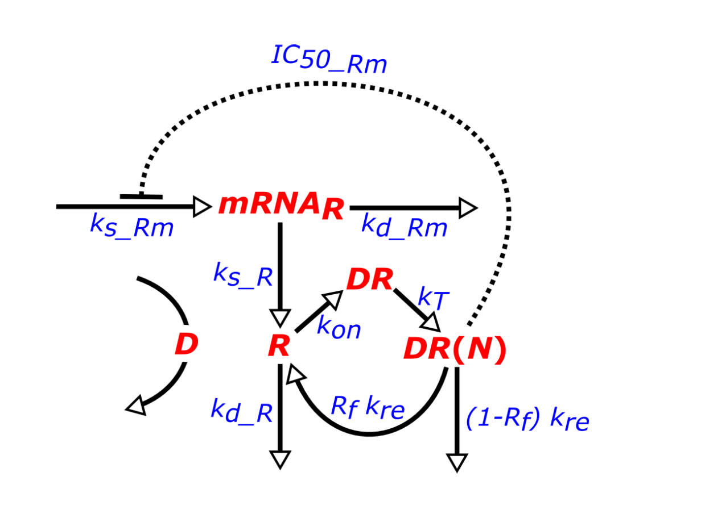

```{r setup, include=FALSE}
knitr::opts_chunk$set(echo = TRUE, warning=FALSE)
```

\pagebreak

\tableofcontents

\pagebreak

# Afkortingen 

* Glucocorticoïdereceptor (GR)
* Methylprednisolon (MPL)
* Receptor (R)
* MPL (D)
* MPL-receptor complex (DR)
* Geactiveerd of in de celkern MPL-receptor complex (DR_N)

\pagebreak

# Introductie

In dit verslag zal er nader gekeken worden naar de werking van glucocorticosteroïden. Er zal worden gekeken naar de dynamica hiervan. Het model wat gebruikt wordt, zal nader worden uitglegd in de theorie. De belangrijkste termen die hier voorbij zullen komen worden alvast kort uitgelegd. 

Glucocorticosteroïden (D) zijn hormonen die worden geproduceerd in de bijnierschors. Het is een samenstelling van glucose, cortex en steroïde. glucocorticosteroïden worden ook vaak gebruikt in de remming van ontstekingen. De glucocorticosteroïden binden aan receptoren (R), er ontstaat dan een glucocorticoïdereceptorcomplex (DR). Dit complex verplaatst naar de celkern en bindt hier aan het DNA (DR_N). De transcriptie van genen die ontstekingen veroorzaken worden tegengehouden door de complexen. Tegelijkertijd worden de genen die ontsteking remmen juist gepromoveerd. Er komen dus meer eiwitten die de ontsteking onderdrukken.

In het onderzoek zal gebruik worden gemaakt van experimentele data. Deze data is afkomstig van ratten. De ratten zijn zeven dagen lang geïnfecteerd met methylprednisolon (een vorm van een glucocorticosteroïde). De ratten zijn geïnfecteerd met twee verschillende doses: 0.1 en 0.3 mg drug/kg rat/h. Hierover zal meer verteld worden in de theorie. 

&nbsp;

Bij het nader kijken wordt er bedoelt dat er aantal situaties worden uitgewerkt. Denk hierbij bijvoorbeeld aan: wat gebeurt er met het systeem als ik een constante vijf keer zo groot maak? Ook wordt er gekeken naar het verloop van het systeem, nadat de toevoer van de dose wordt gehalteerd bij een bepaald tijdstip. Al deze situaties worden vergeleken met de experimentele data.

Eerst wordt de validiteit van het model getest, door de experimentele data te plotten samen met het model. Vervolgens zullen meerdere scenario's worden gesimuleerd.
Zo wordt er gekeken naar het verloop van het model zonder autoregulatie. Wat gebeurt er als de toevoer van drug (D) gestopt wordt na het bereiken van de stabiele toestand? Het modificeren van constanten kan inzicht geven wat voor invloed ze daadwerkelijk hebben op het systeem. Daarom worden in één simulatie constanten $k_{re}$ en $k_{on}$ aangepast. Hoe zullen complexen vormen als de synthese van de vrije receptor wordt geblokkeerd? Als laatste scenario worden de constanten $k_{s\_Rm}$ en $k_{d\_Rm}$ veranderd. Deze zijn belangrijk voor de verandering van hoeveelheid receptoren.

\pagebreak

## Doel
  
Het doel van dit onderzoek is om erachter te komen welke elementen belangrijk zijn in het model. Dus de elementen die van grote invloed zijn op bepaalde waardes. Aan de hand hiervan kan er ook iets gezegd worden over de hoeveelheid drug die kan toe worden gediend. De uitleg over deze elementen wordt in de theorie toegelicht.

Er zijn een aantal verwachtingen bij het model. Allereerst wordt er verwacht dat het aantal receptoren een belangrijke factor zal zijn. Hier bindt de drug aan en zal dus belangrijk zijn. Verder zal ook het aantal drug een belangrijke rol spelen. Zoals eerder vermeld werden de ratten geïnfecteerd met een dosis van 0.1 (laag) en 0.3 (hoog). De verwachting is dat tussen deze waarden een ideale dosering ligt. 

Dit doel kan bereikt worden door aanpassingen te doen aan het model en vervolgens te simuleren. Deze simulaties kunnen vergeleken worden met de experimentele data. Aan de hand hiervan kan worden vastgesteld of een aanpassing, weglating van een element in het model van grote invloed is.

&nbsp;

Verder zijn er verwachtingen van wat er zal gebeuren per simulatie. In de eerste scenario (4.1) wordt er gekeken hoe valide het model werkt vergeleken met de experimentele data, bij twee verschillende doses. Hierbij wordt verwacht dat de grafiek van het model vloeiender zal dan de experimentele data, omdat in het echt altijd afwijkingen zullen zijn. In scenario twee (4.2) worden in meerdere simulaties parameters aangepast om te zien wat voor invloed ze uitoefenen.

In simulatie één (4.2.1) wordt gekeken naar het verloop van $DR_N$ en $mRNAr$, wanneer de synthese van $R$ wel en niet wordt gereguleerd. Er wordt verwacht dat wanneer de synthese van $R$ niet gereguleerd wordt, zowel de $mRNAr$ als $DR_N$ synthese hoger zal zijn. Dit komt door er niet wordt aangegeven dat de aanmaak van $R$ moet minderen.

Vervolgens wordt in simulatie twee (4.2.2) de toevoer van de drug (D) gestopt na het bereiken van een stabiele toestand. Zodra de toevoer D zal stoppen wordt er verwacht dat de synthese van $R$ toeneemt, doordat het niet meer wordt gereguleerd door $D$, zoals in simulatie 1 specifiek wordt bekeken. Door afwezigheid van $D$ kan er geen MPL-complex (DR) meer gevormd worden en dus ook geen geactiveerd MPL-complex (DR_N). 

&nbsp; 

De aanmaak van $mRNAr$ en $R$ wordt beïnvloed door de constanten $k_{re}$ en $k_{on}$ te modificeren. Dit wordt gedaan door de constanten keer en gedeeld door vijf te doen en hetzelfde met twee op verschillende wijzen in simulatie drie (4.2.3). Er wordt verwacht dat bij keer vijf en twee de aanmaak zal stijgen, maar vijf zorgt voor hogere stijgingen. Het omgekeerde wordt verwacht bij een deling, waarbij vijf zorgt voor sterkere dalingen.

In simulatie vier (4.2.4) wordt de synthese van $R$ geblokkeerd. De aanname is dat over tijd de hoeveelheid zal dalen en vervolgens constant verlopen. Deze daling zal stoppen wanneer er te weinig $R$ is om nieuwe $DR$ en $DR_N$ te vormen.

Zoals in simulatie drie worden er constanten in simulatie vijf (4.2.5) gemodificeerd met twee en vijf, namelijk $k_{s\_Rm}$ en $k_{d\_Rm}$. Bij een vermenigvuldiging van vijf en twee wordt er verwacht dat er meer complex $DR$ en $DR_N$ gevormd zal worden. Daartegenover is de synthese van de complexen lager bij een deling van twee en vijf.

\pagebreak

## Theorie

```{r, echo=FALSE, out.width='50%'}

```

Afbeelding 1: *Biologisch model van Glucocorticoid receptor dynamica*

***

In afbeelding 1 is het biologische model van glucocorticoïde dynamica te zien. Hierbij zijn veel constanten betrokken,
die invloed uitoefenen op de hoeveelheid van het eindproduct. Deze worden verder op in dit hoofdstuk beschreven. "Glucocorticoids reverse this effect, resulting in rapid degradation of mRNA and reduced inflammatory protein secretion" \cite{NCBI}. 

Het artikel beschrijft dat glucocorticoïden (drug) zorgt voor degradatie, ofwel vermindering van mRNA, wat resulteert in ontbrekende eiwitten betrokken bij ontstekingsreacties. Het biologisch model werkt deze constatering uit door naast de formule
dat verandering in mRNA berekent over tijd, ook drie andere formules geeft die helpen bij het argumenteren wat er daadwerkelijk gebeurt met de receptoren die worden aangemaakt, het MPL-complex en vervolgens wat er dan gebeurt wanneer het MPL-complex in de celkern bevindt. In hoofdstuk Resultaten, is goed te zien hoe alle formules van elkaar afhangen.

&nbsp;

In het biologische model wordt de samenhang van vier vergelijkingen getoond, waar drug (D) reageert
met receptor (R) tot een Glucocorticoidereceptorcomplex (DR), waar D dus glucocorticoïde is.
In totaal zijn er veertien variabelen betrokken waar dieper op in wordt gegaan bij hoofdstuk "Model configuratie".

Elke formule hieronder beschreven hangt af van aanmaak en afbraak.  Aan de linker kant wordt
er stof X in context Y aangemaakt, wat afhankelijk is van een aantal parameters en daartegenover
is aan de rechter kant van de minus de hoeveelheid dat ervan afgebroken wordt.

De formule waar in dit onderzoek interesse op ligt, berekent de verandering in
hoeveelheid mRNA dat getranscribeerd wordt tot receptoren afhankelijk van
de verandering in tijd. Aan de linkerkant van de formule wordt mRNAr aangemaakt: mRNA dat codeert voor receptoren. 
Snelheidsconstante $ks_{\_Rm}$ beïnvloed het tempo hiervan. Daartegenover beïnvloedt $k_{d\_Rm}$ aan de rechterkant de afbraak.

$$\frac{dmRNA_R}{dt} = ks_{\_Rm} . (1 - \frac{DR(N)}{IC50_{Rm} + DR(N)}) - k_{d\_Rm} . mRNA_R$$

De volgende formule bepaald hoe de verandering in vrije receptoren afhankelijk is van de verandering in tijd.

Vervolgens is in de tweede formule op receptor niveau de snelheidsconstante $ks_{\_R}$ voor aanmaak van receptoren. Constante $k_{on}$ bepaalt de snelheid dat een MPL-receptor complex (DR) gemaakt, wat dus R kost en $kd_{\_R}$ geeft het tempo van afbraak van receptoren aan.

$$\frac{dR}{dt} = ks_{\_R} . mRNA_R + Rf . k_{re} . DR(N ) - k_{on} . D . R - k_{d\_R} · R$$

Verder wordt er gekeken naar hoe de verandering in glucocorticoïde (D) dat reageert met het aantal receptoren (R) tot DR
afhankelijk is van de verandering in tijd. Aan de linkerkant is de productiesnelheid van DR afhankelijk van $k_{on}$ en rechts beïnvloedt $k_T$  de vermindering van
DR in de omgeving. $K_T$ geeft het tempo aan dat het MPL-receptor complex verplaatst richting de nucleus, wat betekent dat de concentratie DR in de omgeving omlaag gaat.
 
$$\frac{dDR}{dt} = k_{on} . D . R - k_T . DR$$

Als laatste wordt de verandering in hoeveelheid DR in de nucleus (DR(N)) gezet tegen
verandering in tijd. De concentratie DR(N) in de nucleus neemt toe door $k_T$. Vervolgens worden er MPL-receptoren van het
complex afgehaald. $K_{re}$ geeft het tempo aan, waarmee deze receptoren terug worden getransporteerd naar het cytosol.

$$\frac{dDR(N)}{dt} = k_T . DR - k_{re} . DR(N )$$
In dit onderzoek worden er doses van methylprednisolon (MPL) toegepast van $D_1$ = 0.1 en $D_2$ = 0.3 mg drug/kg rat/h. De gemeten concentraties van deze dosissen worden gebruikt met $D_1$ = 14.59 ng/ml en $D_2$ = 39.925 ng/ml, maar deze moeten eerst nog worden omgerekend naar nmol / L. Daarop sluiten de volgende berekeningen. $D_1$ wordt $(14.59 . 1000) / 374.471$ en geeft 39.0 nmol / L. $D_2$ wordt $(39.925 . 1000) / 374.471$ en geeft 107 nmol / L.


\pagebreak

# Methode

## Het software model
    
Om de dynamica van de systemen eenvoudig weer te geven, moeten de differentiaal vergelijkingen worden uitgevoerd met verschillende waardes. Dit zal gedaan worden met het deSolve pakket \cite{deSolve} (versie 1.35) in R (versie 4.2.2). 

Er worden twee scenario's behandeld. Er wordt allereerst gekeken naar de validiteit van het model. Vervolgens zal er naar simulatie scenario's worden gekeken, d.w.z. wat gebeurt er met het systeem als een waarde wordt aangepast of weggelaten.

```{r}
# Inladen van het deSolve pakket
library(deSolve)
```

```{r}
# Inladen van het experiment data
experiment.data <- read.csv("../MPL.csv", header = T, sep = ",")
medians <- aggregate(experiment.data[,c("MPL_conc","mRNA","Free_receptor")],
                     list(experiment.data$dose,experiment.data$time),
                     median, na.rm=TRUE)

# Goede namen geven aan de kolommen
names(medians)[1:2] <- c("dose","time")
```

Onderstaand een functie die wordt gebruikt voor een legenda bij elke grafiek.

```{r}
legend.graph <- function(){
  return(
    legend("topright", 
       legend = c("Model", "Median 0.1", "Median 0.3", "Experiment"),
       col = c("#21A9AD", "darkred", "darkgreen", "grey"),
       pch = c(NA, NA, NA, 1),
       lwd = c(2, 2, 2, NA)
       )
  )
}
```

\pagebreak

Voor de 'normale' werking van het model zal onderstaande functie worden gebruikt (validiteit van het model). 

```{r}
verandering_dt.1 <- function (time, parameters, initial.values, D) {
  with(as.list(c(parameters, initial.values)),{
    # Vergelijking van mRNAr
    mRNAr.dt <- Ks_Rm * (1 - (DR_N / (IC50_Rm + DR_N))) - Kd_Rm * mRNAr
    # Vergelijking van R
    R.dt <- Ksr * mRNAr + RF * Kre * DR_N - Kon * D * R - Kd_R * R
    # Vergelijking van DR
    DR.dt <- Kon * D * R - KT * DR
    # Vergelijking van DR(N)
    DR_N.dt <- KT * DR - Kre * DR_N
    
    # Retourneren van de initiële waardes
    return(list(c(DR_N.dt, mRNAr.dt, R.dt, DR.dt)))
  })
}
```

Onderstaand de functie die wordt gebruikt bij de situatie die de blokkering van autoregulatie behandeld (simulatie van scenario's).

```{r}
verandering_dt.2.1 <- function (time, parameters, initial.values, D) {
  with(as.list(c(parameters, initial.values)),{
    # Vergelijking van mRNAr
    mRNAr.dt <- Ks_Rm - Kd_Rm * mRNAr
    # Vergelijking van R
    R.dt <- Ksr * mRNAr + RF * Kre * DR_N - Kon * D * R - Kd_R * R
    # Vergelijking van DR
    DR.dt <- Kon * D * R - KT * DR
    # Vergelijking van DR(N)
    DR_N.dt <- KT * DR - Kre * DR_N
    
    # Retourneren van de initiële waardes
    return(list(c(DR_N.dt, mRNAr.dt, R.dt, DR.dt)))
  })
}
```

\pagebreak

## Model configuratie

In dit hoofdstuk worden alle parameters behandeld die gebruikt en gemodificeerd worden.

```{r}
# Pakket inladen voor mooiere tabel
library(pander)
```

Tabel 1: *Variabelen betrokken bij opzetten experiment opgedeeld in zeven constanten, drie parameters en vier initiële waarden.*
          
```{r}
# Drie categorieën aan soorten input waarden
Categorie <- c(rep("Initiële waarden", 4), 
               rep("Parameters", 10))

# Waarden uit bovenstaande categorieën verkregen van experiment
# Omdat DR een reactie is tussen D en R gaan de waarden keer elkaar
Waarden<- c("mRNAr"=4.74, "DR_N"=0, "R"=267, "DR"=0, "ks_Rm"=2.90, 
          "kd_Rm"= 0.612, "k_re"=0.57, "k_T"=0.63,  "k_on"= 0.00329, 
          "k_d_R"=0.0572, "k_s_r"=3.22, "IC50_Rm"=26.2, "RF"=0.49, "D"=53.4)

# Eenheden in een vector verwerkt. Met functie 'rep()' kan een iterable X
# keer herhaald worden.
Eenheden <- c("fmol / g liver", rep("fmol/mg protein", 3),
              rep("fmol/g liver/h", 2), rep("1 / h", 2),
              "L/nmol/h", rep("1 / h", 2), "fmol/mg protein",
              "", "nmol/L")

# Dataframe waar vector namen in de header komen, waarde namen als rij namen 
# en de daadwerkelijke waarden daarin verwerkt.
model.conf <- data.frame(Waarden, Categorie, Eenheden)
# Tekenen van tabel
pander(model.conf)
```

Zoals eerder vermeld worden er twee situaties uitgewerkt. Er wordt allereerst gekeken naar de validiteit van het model. Er moet wel verschuiving in de parameters plaatsvinden, dit wordt allemaal in de onderstaande alinea('s) weergegeven.

### Scenario één: Validiteit van het model

Hieronder staan de parameters die gebruikt zijn bij het scenario die kijkt naar de validiteit van het model. Goed om op te merken is dat D niet in de vectoren wordt verwerkt, omdat de concentraties in het onderzoek variëren
van 53.4 tot 39 (dosis 0.1) tot 107 (dosis 0.3). Als oplossing worden de concentraties direct aan de functie ode() gegeven.

```{r}
# Definiëren van de parameters
parameters.1 <- c(Ks_Rm = 2.90, IC50_Rm = 26.2, 
                Kon = 0.00329, KT = 0.63, 
                Kre = 0.57, RF = 0.49, 
                Kd_R = 0.0572, Kd_Rm = 0.612, 
                Ksr = 3.22)

parameters.experiment <- c(Ks_Rm = 2.90, IC50_Rm = 26.2, 
                Kon = 0.00329, KT = 0.63, 
                Kre = 0.57, RF = 0.49, 
                Kd_R = 0.0572, Kd_Rm = 0.612, 
                Ksr = 3.22)

# Tijdspunten definiëren
times.1 <- 0 : 168

# Het definiëren van de initiële waardes
initial.values.1 <- c(DR_N = 0, mRNAr = 4.74, R = 267, DR = 0)
```

Tijdsequentie die gebruikt wordt bij de sectie die kijkt naar de juistheid van het model

```{r}
times.2.1 <- 0 : 48
```

### Scenario twee: Simulatie scenario's

Bij scenario twee (simulatie scenario's) zijn veel verschillende parameters gebruikt. Er zal bij een situatie worden gekeken wat er gebeurt bij een aanpassing aan $Kon$ (snelheidsconstante vorming DR) en $Kre$ (afbraakconstante DR_N naar R). Per concentratie zullen de concentraties dissociëren en associëren met vijf en twee door de volgende formules. Waar dissociatie wordt bepaald door deling met vijf en twee, associatie wordt bepaald door vermenigvuldiging met twee en vijf. Onderstaand volgt de uitwerking hiervan.

```{r}
# Kon / 5
parameters.1["Kon"] = 0.00329 / 5
dataset.kon.g5 <- ode(initial.values.1, times.1, 
                      verandering_dt.1, parameters.1, D = 53.4)

# Kon / 2
parameters.1["Kon"] = 0.00329 / 2
dataset.kon.g2 <- ode(initial.values.1, times.1, 
                      verandering_dt.1, parameters.1, D = 53.4)

# Kon * 5
parameters.1["Kon"] = 0.00329 * 5
dataset.kon.k5 <- ode(initial.values.1, times.1, 
                      verandering_dt.1, parameters.1, D = 53.4)

# Kon * 2
parameters.1["Kon"] = 0.00329 * 2
dataset.kon.k2 <- ode(initial.values.1, times.1, 
                      verandering_dt.1, parameters.1, D = 53.4)

# Kre variabele
# Kre / 5
parameters.1["Kre"] = 0.57 / 5
dataset.kre.g5 <- ode(initial.values.1, times.1, 
                      verandering_dt.1, parameters.1, D = 53.4)

# Kre / 2
parameters.1["Kre"] = 0.57 / 2
dataset.kre.g2 <- ode(initial.values.1, times.1,
                      verandering_dt.1, parameters.1, D = 53.4)

# Kre * 5
parameters.1["Kre"] = 0.57 * 5
dataset.kre.k5 <- ode(initial.values.1, times.1,
                      verandering_dt.1, parameters.1, D = 53.4)

# Kre * 2
parameters.1["Kre"] = 0.57 * 2
dataset.kre.k2 <- ode(initial.values.1, times.1, 
                      verandering_dt.1, parameters.1, D = 53.4)

```

Verder wordt er in een situatie gekeken naar stopzetting van de synthese van vrije R. Er wordt het standaard model gebruikt, waar $Ks_{Rm}$ = 0, $D$ = 53.4 en de tijdsequentie is $t$ = 48 uur.

Er zal ook worden gekeken naar het stoppen van de toevoeging van D na het bereiken van de steady state. Onderstaand de tijdsequentie die hierbij gebruikt wordt.

```{r}
times.2.2 <- 48 : 96
```

&nbsp;

In de laatste situatie veranderen de parameters $Ks_{Rm}$ en $Kd_{Rm}$ op basis van toename (keersom) van twee en vijf
of een afname (deling) van twee en vijf. Echter, is $Kd_{Rm}$ bij iedere toename of afname nog afhankelijk van de
hoeveelheid mRNAr vanaf $t$ = 0, wat 4.74 (n) is. Door het veranderen van deze snelheidsconstanten wordt de aanmaak
van mRNAr beïnvloed.

```{r}
parameters.2 <- c(Ks_Rm = 2.90, IC50_Rm = 26.2, 
                Kon = 0.00329, KT = 0.63, 
                Kre = 0.57, RF = 0.49, 
                Kd_R = 0.0572, Kd_Rm = 0.612, 
                Ksr = 3.22)


parameters.2["Ks_Rm"] = 2.9 / 5
parameters.2["Kd_Rm"] = 2.9 / 5 / 4.74
dataset.g5 <- ode(initial.values.1, times.2.1, 
                  verandering_dt.1, parameters.2, D = 53.4)


parameters.2["Ks_Rm"] = 2.9 / 2
parameters.2["Kd_Rm"] = 2.9 / 2 / 4.74 
dataset.g2 <- ode(initial.values.1, times.2.1, 
                  verandering_dt.1, parameters.2, D = 53.4)


parameters.2["Ks_Rm"] = 2.9 * 5
parameters.2["Kd_Rm"] = 2.9 * 5 / 4.74
dataset.k5 <- ode(initial.values.1, times.2.1, 
                  verandering_dt.1, parameters.2, D = 53.4)


parameters.2["Ks_Rm"] = 2.9 * 2
parameters.2["Kd_Rm"] = 2.9 * 2 / 4.74
dataset.k2 <- ode(initial.values.1, times.2.1,
                  verandering_dt.1, parameters.2, D = 53.4)
```

\pagebreak

# Resultaten
    
In deze sectie zal er worden gekeken naar de resultaten. De antwoorden op de scenario's worden behandeld in de discussie sectie.

## Scenario één, testen van de validiteit

### Plotten van de experimentele data samen met het model

```{r}
# Het uitvoeren van de testen met de juiste Drug waardes
verloop.dataset <- ode(initial.values.1, times.1, 
                       verandering_dt.1, parameters.1, D = 53.4)

verloop.dataset.lage.doses <- ode(initial.values.1, times.1, 
                       verandering_dt.1, parameters.experiment, D = 39)

verloop.dataset.hoge.doses <- ode(initial.values.1, times.1, 
                       verandering_dt.1, parameters.experiment, D = 107)
```

```{r}
library(ggplot2)
# Voor het gebruik van ggplot, moet de data eerst in dataframes worden gezet
# Dit wordt hieronder gedaan
lage.dosis <- data.frame(
  time = verloop.dataset.lage.doses[, 1],
  mRNAr_waarde = verloop.dataset.lage.doses[, 3],
  R_waarde = verloop.dataset.lage.doses[, 4])

experiment.lage.dosis <- data.frame(
  time = medians$time[medians$dose == 0.1],
  mRNAr_waarde = medians$mRNA[medians$dose == 0.1],
  R_waarde = medians$Free_receptor[medians$dose == 0.1])

hoge.dosis <- data.frame(
  time = verloop.dataset.hoge.doses[, 1],
  mRNAr_waarde = verloop.dataset.hoge.doses[, 3],
  R_waarde = verloop.dataset.hoge.doses[, 4])

experiment.hoge.dosis <- data.frame(
  time = medians$time[medians$dose == 0.3],
  mRNAr_waarde = medians$mRNA[medians$dose == 0.3],
  R_waarde = medians$Free_receptor[medians$dose == 0.3])

experiment.punten <- data.frame(
  mRNAr_waarde = experiment.data$mRNA, 
  time = experiment.data$time,
  R_waarde = experiment.data$Free_receptor)
```

\pagebreak

```{r, fig.cap = "*Nog in te vullen*"}
# Het definiëren van de plots
mRNAr_lage.dosis <- ggplot(mapping = aes(x = time, y = mRNAr_waarde)) +
  geom_line(data = lage.dosis, aes(colour = "Model"), linewidth = 1.5) +
  geom_line(data = experiment.lage.dosis, aes(colour = "Mediaan"), 
  linewidth = 1.5) + scale_colour_manual(values = c("darkred", "steelblue")) + 
  ylim(0,8) + labs(title = "Verloop [mRNAr] lage dosis", 
  subtitle = "Dosis: 0.1") + theme(plot.title = element_text(color="black", 
  size=7, face="bold.italic"), plot.subtitle = element_text(color = "red", 
  size = 5))

mRNAr_hoge.dosis <- ggplot(mapping = aes(x = time, y = mRNAr_waarde)) +
  geom_line(data = hoge.dosis, aes(colour = "Model"), linewidth = 1.5) +
  geom_line(data = experiment.hoge.dosis, aes(colour = "Experiment"), 
  linewidth = 1.5) + scale_colour_manual(values = c("darkred", "steelblue", 
  "black")) + ylim(0,8) + labs(title = "Verloop [mRNAr] hoge dosis", 
  subtitle = "Dosis: 0.3") + theme(plot.title = element_text(color="black", 
  size=7, face="bold.italic"), plot.subtitle = element_text(color = "red", 
  size = 5))

R_lage.dosis <- ggplot(mapping = aes(x = time, y = R_waarde)) +
  geom_line(data = lage.dosis, aes(colour = "Model"), linewidth = 1.5) +
  geom_line(data = experiment.lage.dosis, aes(colour = "Mediaan"), 
  linewidth = 1.5) + scale_colour_manual(values = c("darkred", "steelblue")) + 
  ylim(0, 500) + labs(title = "Verloop [R] lage dosis", subtitle = "Dosis: 0.1") +
  theme(plot.title = element_text(color="black", size=7, face="bold.italic"),
  plot.subtitle = element_text(color = "red", size = 5))

R_hoge.dosis <- ggplot(mapping = aes(x = time, y = R_waarde)) +
  geom_line(data = hoge.dosis, aes(colour = "Model"), linewidth = 1.5) +
  geom_line(data = experiment.hoge.dosis, aes(colour = "Mediaan"), 
  linewidth = 1.5) + scale_colour_manual(values = c("darkred", "steelblue")) + 
  ylim(0, 500) + labs(title = "Verloop [R] hoge dosis", subtitle = "Dosis: 0.3") +
  theme(plot.title = element_text(color="black", size=7, face="bold.italic"),
  plot.subtitle = element_text(color = "red", size = 5))
```

\pagebreak

```{r, fig.cap = "***Model verloop samen met experimentele data. De experimentele wordt weergegeven met behulp van de mediaan. Het plot bestaat uit vier kleine plots. Bij alle figuren staat de tijd op de x-as. Bij de bovenste twee figuren staat mRNAr op de y-as en bij de onderste twee figuren staat het aantal vrije receptoren op de y-as. Er wordt gekeken naar zowel een lage, als hoge dosis D. Voor de toediening van een lage en hoge dosis, is er weinig effect te zien bij het model-verloop van mRNAr. Bij een hoge dosis is het aantal model-mRNAr een fractie lager. Bij de experimentele data is er wel een duidelijk verschil tussen lage en hoge dosis. Bij een lage dosis D is er te zien dat het verloop van het mRNAr een stuk meer schokkerig is: de punten liggen verder uit elkaar. D.w.z., er zijn meer pieken en dalen. Beide dosissen vertonen wel een vergelijkbaar patroon, eerste blijf het verloop een rechte lijn, vervolgens daalt het iets en tot slot stijgt het explosief omhoog. Voor het aantal vrije receptoren is er wel een opvallend verschil bij de model-data. Bij een hoger dosis wordt de steady state sneller bereikt en ligt het niveau van de steady state een stuk lager. Voor de experimentele data ligt het niveau bij een lage dosis een fractie boven het modelwaarde. Voor een hoge dosis ligt de experimentele data ongeveer op een gelijk niveau, maar het daalt na verloop van tijd wel lineair.***"}
# Naast elkaar plotten van de figuren
library(patchwork)
mRNAr_lage.dosis + mRNAr_hoge.dosis + R_lage.dosis + R_hoge.dosis
```

\pagebreak

Door het plotten van een mediaan wordt het midden van de data gevisualiseerd. De helft van de data
ligt boven de lijn en de andere helft eronder. De data wordt niet naar beneden (getrokken) door uitschieters,
daarom is het een mooie methode om het verloop te zien.

&nbsp;

In het verloop van mRNA is weinig verandering te zien afhankelijk van de dosis. Er is weliswaar bij een hoge dosis
een lager aantal mRNA, dit is absoluut niet significant. Verder is er wel een groot verschil bij het aantal vrije
receptoren door een hogere dosis drug (D).

De resultaten van het model liggen over het algemeen op een goede lijn met de experimentele data.
Bij het aantal vrije receptoren ligt het verloop van het model tussen de twee medianen, dus
overlapt het model goed met experimentele data. Echter, is er wel een lagere werkelijkheid bij het aantal mRNA.
Dat wil zeggen het aantal mRNA wordt hoger geschat in het model.

\pagebreak

## Scenario twee, simulatie scenario's

### Verloop van het model zonder autoregulatie

```{r} 
# Het aanroepen van de ode functie, waardes worden opgeslagen
verloop.dataset.r.niet.afhankelijk <- ode(initial.values.1,
                  times.2.1, verandering_dt.2.1, parameters.1, D=53.4)

R.afhankelijk <- data.frame(
  time = verloop.dataset[, 1],
  DR_N = verloop.dataset[, 2],
  mRNAr = verloop.dataset[, 3])

R.niet.afhankelijk <- data.frame(
  time = verloop.dataset.r.niet.afhankelijk[, 1],
  DR_N = verloop.dataset.r.niet.afhankelijk[, 2],
  mRNAr = verloop.dataset.r.niet.afhankelijk[, 3])
```

```{r}
R.afhankelijk.plot.DR_N <- ggplot(mapping = aes(x = time, y = DR_N)) +
  geom_line(data = R.afhankelijk, aes(colour = "Model"), linewidth = 1.5) +
  scale_colour_manual(values = "darkred") + xlim(0, 50) +
  labs(title = "Verloop van [DR_N]", 
  subtitle = "R afhankelijk (Normale siuatie)") +
  theme(plot.title = element_text(color="black", size=7, face="bold.italic"),
  plot.subtitle = element_text(color = "red", size = 5))

R.niet.afhankelijk.plot.DR_N <- ggplot(mapping = aes(x = time, y = DR_N)) +
  geom_line(data = R.niet.afhankelijk, aes(colour = "Model"), linewidth = 1.5) +
  scale_colour_manual(values = "darkred") + xlim(0, 50) +
  labs(title = "Verloop van [DR_N]", subtitle = "R niet afhankelijk") +
  theme(plot.title = element_text(color="black", size=7, face="bold.italic"),
  plot.subtitle = element_text(color = "red", size = 5))

R.afhankelijk.plot.mRNAr <- ggplot(mapping = aes(x = time, y = mRNAr)) +
  geom_line(data = R.afhankelijk, aes(colour = "Model"), linewidth = 1.5) +
  scale_colour_manual(values = "steelblue") + xlim(0, 50) + ylim(0,5) +
  labs(title = "Verloop van [mRNAr]", 
  subtitle = "R afhankelijk (Normale situatie)") +
  theme(plot.title = element_text(color="black", size=7, face="bold.italic"),
  plot.subtitle = element_text(color = "red", size = 5))

R.niet.afhankelijk.plot.mRNAr <- ggplot(mapping = aes(x = time, y = mRNAr)) +
  geom_line(data = R.niet.afhankelijk, aes(colour = "Model"), linewidth = 1.5) +
  scale_colour_manual(values = "steelblue") + xlim(0, 50) + ylim(0, 5) +
  labs(title = "Verloop van [mRNAr]", subtitle = "R niet afhankelijk") +
  theme(plot.title = element_text(color="black", size=7, face="bold.italic"),
  plot.subtitle = element_text(color = "red", size = 5))
```

```{r, fig.cap="***Het verloop van DR_N en mRNAr bij een R wel/niet afhankelijk. Figuur twee bestaat wederom uit vier kleine plots. De bovenste twee plots geven het verloop van DR_N weer (links R afhankelijk, rechts niet). De onderste twee plots zijn voor het verloop van mRNAr. Bij het verloop van DR_N stijgen beide grafieken eerst hard, vervolgens wordt het maximum bereikt en tot slot dalen de grafieken naar een constante waarde. Bij een R die niet afhanklijk is, ligt de constante waarde een stuk hoger. Voor het verloop van mRNAr is er een significant verschil tussen wel/geen R. Bij de niet-afhankelijke R, blijft het verloop op een constante waarde. Voor de 'normale' situtatie daalt de grafiek eerst en stijgt vervolgens naar een constante waarde.***"}
R.afhankelijk.plot.DR_N + R.niet.afhankelijk.plot.DR_N + R.afhankelijk.plot.mRNAr + R.niet.afhankelijk.plot.mRNAr
```

In figuur 2 wordt het model geplot nadat D weggehaald wordt uit de formule van 
"R.dt" uit de keersom met Kon * R. Het doel is om te kijken wat er gebeurt met de concentratie DR_N wanneer
R niet afhankelijk is aan D. We halen D uit de formule, omdat het de synthese van mRNA voor vrije receptor betreft.

\pagebreak

### Toevoer van de drug (D) stoppen na het bereiken van de stabiele toestand

```{r}
# 'normaal' verloop van 48 uur.
verloop.dataset.48.uur <- ode(y=initial.values.1, 
              times=times.2.1,func=verandering_dt.1,parms=parameters.1,D=53.4)

# aanpassen van de initiele waardes
initial.values.2 <- verloop.dataset.48.uur[48, 2:5]

# dataset vanaf steday state zonder toevoer van D
verloop.steady.state <- ode(y=initial.values.2, 
              times=times.2.2,func=verandering_dt.1,parms=parameters.1, D=0)

normaal.verloop.48.uur <- data.frame(
  time = verloop.dataset.48.uur[, 1],
  DR_N = verloop.dataset.48.uur[, 2],
  mRNAr = verloop.dataset.48.uur[, 3])
  
steady.state <- data.frame(
  time = verloop.steady.state[, 1],
  DR_N = verloop.steady.state[, 2],
  mRNAr = verloop.steady.state[, 3])
```

```{r, fig.cap = "***Het verloop van DR_N bij het stoppen van de toevoer van D, na het bereiken van de steady state. Op de x-as staat de tijd en op de y-as staat het aantal DR_N. De steady state wordt bereikt op t=48. Vervolgens daalt het aantal DR_N sterk naar nul.***"}
ggplot() +
  geom_line(data = normaal.verloop.48.uur, mapping = aes(x = time, 
  y = DR_N, colour = "DR_N normaal verloop"), linewidth = 1.2) +
  geom_line(data = steady.state, mapping = aes(x = time, y = DR_N, 
  colour = "DR_N steady state"), linewidth = 1.2, linetype = "dashed") +
  scale_colour_manual(values = c("black", "darkred")) +
  labs(title = "Verloop [DR_N]", 
  subtitle = "De toediening van D stopt na het bereiken van de steady state") +
  theme(plot.title = element_text(color="black", size=12, face="bold.italic"),
  plot.subtitle = element_text(color = "red", size = 10))
```

\pagebreak

```{r, fig.cap = "***Het verloop van mRNAr bij het stoppen van de toevoer van D, na het bereiken van de steady state. Op de x-as staat de tijd en op de y-as staat het aantal mRNAr. De steady state wordt bereikt op t=48. Na het bereiken van de steady state, stijg het aantal mRNAr flink. Vervolgens blijft het op een constante waarde.***"}
ggplot() +
  geom_line(data = normaal.verloop.48.uur, mapping = aes(x = time, y = mRNAr, 
  colour = "mRNAr normaal verloop"), linewidth = 1.2) + 
  geom_line(data = steady.state, mapping = aes(x = time, y = mRNAr, 
  colour = "mRNAr steady state"), linewidth = 1.2, linetype = "dashed") +
  scale_colour_manual(values = c("black", "darkred")) +
  labs(title = "Verloop [mRNAr]", 
  subtitle = "De toediening van D stopt na het bereiken van de steady state") +
  theme(plot.title = element_text(color="black", size=12, face="bold.italic"),
        plot.subtitle = element_text(color = "red", size = 10))
```

Het is duidelijk te zien in beide grafieken wanneer de drug dosis naar 0 gaat.

\pagebreak

### Het modificeren van de constanten $k_{re}$ en $k_{on}$

```{r}
# Stel de datasetnamen in een lijst
dataset_list <- list(dataset.kon.g5, dataset.kon.g2, 
                     dataset.kon.k5, dataset.kon.k2, dataset.kre.g5, 
                     dataset.kre.g2, dataset.kre.k5, dataset.kre.k2)

# Stel de plotlabels in een lijst
label_list <- c("mRNAr Kon / 5 (E)", "R Kon / 5 (F)", "mRNAr Kon / 2 (G)", 
                "R Kon / 2 (H)", "mRNAr Kon * 5 (I)", "R Kon * 5 (J)", 
                "mRNAr Kon * 2 (K)", "R Kon * 2 (L)",
                "mRNAr Kre / 5 (M)", "R Kre / 5 (N)", "mRNAr Kre / 2 (O)" , 
                "R Kre / 2 (P)", "mRNAr Kre * 5 (Q)", "R Kre * 5 (R)", 
                "mRNAr Kre * 2 (S)", "R Kre * 2 (T)")
```

\pagebreak

```{r, out.width='75%', out.height='75%', fig.cap="Het verloop van mRNAr en R bij een aanpassing aan de constanten Kre en Kon. De parameters 'Kon' en 'Kre' worden aangepast op de volgende manier. $Kre$ of $Kon$ worden gedeeld door vijf en twee, ook worden ze vermenigvuldigd met vijf en twee. Onderstaand de uitgebreide beschrijving van de plots."}

par(mfrow = c(2, 4))

# Maak een lus om de plots te maken voor elke dataset
for (i in 1:length(dataset_list)) {
  plot(dataset_list[[i]][, "mRNAr"], type = "l", main = label_list[2*i-1])
  plot(dataset_list[[i]][, "R"], type = "l", main = label_list[2*i])
}
```

\pagebreak

Allereerste wordt er gekeken naar de verandering in mRNAr.
Bij een deling van vijf bij $Kon$ daalt de grafiek sneller aan het begin tot t = 10. Vervolgens
neemt het minder snel toe. Bij de deling door twee is er een minuscuul verschil. De vermenigvuldiging van $Kon$ vertoont bij vijf een snellere daling. Het tweede deel van de grafiek vertoont geen verschil met de originele waarde. Dit geldt ook bij de vermenigvuldiging van twee.

Verder is bij een deling van vijf voor $Kre$ een groter verschil. De daling aan het begin
lijkt identiek te zijn, maar de toename neemt minder snel toe tot bijna een rechte lijn.
Bij de deling door twee is er het begin ook bijna identiek, maar is de stijging minder snel. Voor de vermenigvuldiging van $Kre$ met vijf is er een sneller daling aan het begin en vervolgens een snellere stijging. De steady state is ook hoger dan in het originele model. Bij de vermenigvuldiging van twee geldt hetzelfde verhaal, maar dan in mindere mate, d.w.z, de stijging is iets minder snel dan bij de vermenigvuldiging van vijf.

Nu de mRNA behandeld is, kan er gekeken worden naar het verloop van de vrije receptoren.

Alle grafieken van R vertonen kleine veranderingen. Om te beginnen met de deling van vijf voor $Kon$. Bij deze grafiek is de afname minder snel dan bij het originele. De deling van twee vertoont bijna een identiek beeld met de deling van vijf. Voor de vermenigvuldiging geldt een omgekeerde beeld. De afname is voor zowel, vijf als twee, sneller. De vermenigvuldiging van vijf vertoont een significant sneller beeld. 

Voor de correcties van $Kre$ heeft de deling meer effect dan de vermenigvuldiging. Bij de vermenigvuldiging (zowel vijf als twee) ontstaan grafieken die bijna hetzelfde beeld vertonen als het originele model. Alleen de stijging is een fractie sneller. De deling komt wel een ander beeld naar voren. De stijging is bij de vermenigvuldiging van vijf een stuk sneller. De steady state een stuk lager als bij het originele model. Voor de vermenigvuldiging van twee is de stijging sneller, maar niet sneller dan die van vijf. De steady state komt ook hier lager uit.

\pagebreak

### Het blokkeren van de synthese van de vrije receptor

```{r}
parameters.1["Ks_Rm"] = 0

dataset.geen.R.synthese <- ode(initial.values.1, times.2.1, 
                      verandering_dt.1, parameters.1, D = 53.4)

verloop.dataset.48.uur.wel.R <- data.frame(
  time = verloop.dataset.48.uur[, 1],
  R = verloop.dataset.48.uur[, 4],
  mRNAr = verloop.dataset.48.uur[, 3])

dataset.48.uur.geen.R.synthese <- data.frame(
  time = dataset.geen.R.synthese[, 1],
  R = dataset.geen.R.synthese[, 4],
  mRNAr = dataset.geen.R.synthese[, 3])
```

\pagebreak

```{r, fig.cap="***In figuur 7 is het verloop van R te zien bij een normale situatie en bij een blokkering van de synthese. Op de x-as staat de tijd en op de y-as staat het aantal R. Er worden twee lijnen weergegeven in één grafiek. Beide lijnen (wel R, geen R) vertonen een vegelijkbaar patroon. Het verloop begint met een daling die steeds langzamer afneemt tot een constante waarde. De daling aan het begin is voor beide lijnen hetzelfde. Bij de lijn waarbij synthese van R niet wordt geblokkeerd wordt de steady state eerder bereikt dan bij de lijn waar de synthese wordt geblokkeerd. Bij een blokkering daalt de grafiek iets meer en eindigt de lijn in een lager constante waarde.***"}
ggplot() +
  geom_line(data = verloop.dataset.48.uur.wel.R, 
  mapping = aes(x = time, y = R, colour = "Wel R"), linewidth = 1.2) +
  geom_line(data = dataset.48.uur.geen.R.synthese,
  mapping = aes(x = time, y = R, colour = "Geen R (blokkering)"), 
  linewidth = 1.2) + scale_colour_manual(values = c("darkred", "steelblue")) +
  labs(title = "Verloop [R]", 
  subtitle = "Zowel met als zonder de synthese blokkering") +
  theme(plot.title = element_text(color="black", size=12, face="bold.italic"),
        plot.subtitle = element_text(color = "red", size = 10))
```

Om deze grafiek te maken is parameter Ks_Rm naar nul veranderd. Ks_Rm is verantwoordelijk voor de aanmaak per tijdeenheid van mRNAr.

Door deze parameter naar nul te veranderen, zal in verloop van tijd geen mRNAr meer worden
aangemaakt. In de grafiek is te zien dat de hoeveelheid vrije R blijft afnemen. Deze
verloopt tot een constante lijn bij y ~ 40-50 en bij t ~ 20. Omdat vrije R hergebruikt wordt,
zal er altijd een beetje aanwezig blijven en de lijn dus nooit 0 raken.

\pagebreak

### Het modificeren van de constanten $k_{s\_Rm}$ en $k_{d\_Rm}$

In de plotten beneden wordt er gekeken naar wat er gebeurt in het systeem, als de snelheidsconstanten Ks_Rm en Kd_rm die de aanmaak en afbraak van mRNAr beïnvloeden
toenemen of afnemen. 

```{r, fig.cap = "***In de bovenstaande figuur staan in de vier grafieken op de x-as het verloop van tijd in uren en op de y-as de verandering in stof verschillend per context. In grafiek B is te zien hoe de hoeveelheid mRNA eerst afneemt bij omzetting naar R. Vervolgens verloopt de aanmaak mRNAr richting een bijna constante lijn vanaf t ~ 10. De hoeveelheid R in grafiek C neemt eerst alleen af, omdat er DR vormt. Over tijd zal R (n) als gevolg van de monotone productie in mRNAr, geen veranderingen meer hebben in toename of afname. Verder is te zien dat de concentraties MPL-complex in grafieken A en D eerst toenemen, maar vervolgens zal de productie ook niet meer veranderen. Op basis van de bovenstaande bevindingen is te zien, dat het systeem reageert zoals verwacht op het stilliggende gedrag van de productie in mRNAr.***"}

plot(dataset.g2, main = c("DR_N (A)", "mRNAr (B)", 
                          "R (C)", "DR (D)"),
     ylab = c("hoeveelheid DR_N (n)", "hoeveelheid mRNAr (n)",
              "hoeveelheid R (n)", "hoeveelheid DR (n)"),
     xlab = "Tijd (in uren)")
mtext("Ks_Rm en Kd_Rm gedeeld door vijf",                   
      side = 3,
      line = - 1,
      outer = TRUE)
```

\pagebreak

```{r, fig.cap = "***In grafiek B is te zien hoe de hoeveelheid mRNA langzamer afneemt dan bij figuur 8. Vervolgens verloopt de aanmaak vanaf t ~ 20 mRNAr minder snel richting een constante lijn. De hoeveelheid R in grafiek C neemt minder snel af in het begin. De rest van de curve verloopt hetzelfde. Grafieken A en D verlopen nagenoeg hetzelfde.***"}
plot(dataset.g5, main = c("DR_N (A)", "mRNAr (B)", 
                          "R (C)", "DR (D)"),
     ylab = c("hoeveelheid DR_N (n)", "hoeveelheid mRNAr (n)",
              "hoeveelheid R (n)", "hoeveelheid DR (n)"),
     xlab = "Tijd (in uren)")
mtext("Ks_Rm en Kd_Rm gedeeld door twee",                   
      side = 3,
      line = - 1,
      outer = TRUE)
```

Het wordt duidelijk dat bij een deling door twee, minder grote impact is op de aanmaak van receptoren dan bij een deling van 5.

&nbsp;

\pagebreak

```{r, fig.cap = "***In grafiek B is te zien hoe de hoeveelheid mRNA eerst stijl afneemt bij omzetting naar R. Vervolgens verloopt de aanmaak mRNAr richting een constante lijn, op een gelijke manier als bij figuur 8. Echter, begint de aanmaak al bij t ~ 5. In grafiek C neemt R (n) steiler af. Grafieken A en D reageren als gevolg van het gedrag van grafiek B op dezelfde wijze als in figuur 8.***"}
plot(dataset.k5, main = c("DR_N (A)", "mRNAr (B)", 
                          "R (C)", "DR (D)"),
     ylab = c("hoeveelheid DR_N (n)", "hoeveelheid mRNAr (n)",
              "hoeveelheid R (n)", "hoeveelheid DR (n)"),
     xlab = "Tijd (in uren)")
mtext("Ks_Rm en Kd_Rm keer vijf",                   
      side = 3,
      line = - 1,
      outer = TRUE)
```

Zoals verwacht daalt de hoeveelheid mRNAr veel sneller aan het begin, omdat de afname constante verhoogd is. Tevens
begint de toename veel eerder door een verhoogde toename constante. 

\pagebreak

```{r, fig.cap = "***In grafiek B is te zien hoe de hoeveelheid mRNA iets minder stijl afneemt bij omzetting naar R dan bij figuur 10. Vervolgens verloopt de aanmaak mRNAr iets later, vanaf t ~ 7. Grafieken A, C en D reageren wederom op dezelfde manier.***"}
plot(dataset.k2, main = c("DR_N (A)", "mRNAr (B)", 
                          "R (C)", "DR (D)"),
     ylab = c("hoeveelheid DR_N (n)", "hoeveelheid mRNAr (n)",
              "hoeveelheid R (n)", "hoeveelheid DR (n)"),
     xlab = "Tijd (in uren)")
mtext("Ks_Rm en Kd_Rm keer twee",                   
      side = 3,
      line = - 1,
      outer = TRUE)
```

Het feit dat de afname minder steil verloopt, voldoet aan de verwachting dat; vermenigvuldigd met twee minder grote invloed uitoefent dan keer vijf. Ook de toename wordt met dezelfde logica beïnvloed en neemt iets later pas toe.


\pagebreak

# Discussie en Conclusie

## Discussie
    
Uit de resultaten sectie zijn behoorlijk wat resultaten naar voren gekomen. 

Ten eerste werd er verwacht dat het aantal $D$ een belangrijke rol zou spelen. Dit werd duidelijk in (4.1.1). Al snel bleek dat na een dose van (0.3) minder $mRNAr$ en $R$ aanwezig was over de gehele tijdsequentie. Dit komt doordat hoe meer $D$ er is, hoe meer deze kan binden met $R$ tot een MPL-complex. Hiermee wordt aangetoond dat $D$ inderdaad reageert in het systeem en dus belangrijke rol speelt. 

Verder werd er ook verwacht dat het aantal vrije receptoren een belangrijke rol speelt. Het bewijs voor deze verwachting werd getoond in (4.2.1). De grafiek van $DR_N$ vertoond een behoorlijk ander verloop. De stijging is namelijk veel sneller. Als de drug geen effect heeft op de synthese van $R$, komt er een veel hogere concentratie van $R$. Hierdoor komt er ook veel meer $DR_N$ en dus ook veel meer bijwerkingen. $R$ speelt dus een belangrijke rol.


&nbsp;

Bij vraagstuk (4.2.2) over het stoppen van het toedienen van $D$, na het bereiken van de steady state, viel iets op. De grafieken stegen of daalden explosief na het stoppen van het toedienen. Achteraf is dit natuurlijk logisch te verklaren. De hoeveelheid $D$ speelt in alle vergelijkingen door. Als deze dus plotseling naar nul zal gaan, is dit van directe invloed op de andere vergelijkingen.

&nbsp;

De verwachting voor simulatie (4.2.3) kwam overeen met de resultaten van $mRNAr$, bij zowel $Kon$ als $Kre$. Een deling van vijf zorgde voor een sterkere afname dan door twee. Verder zorgde het productwaarde van vijf voor een hogere aanmaak dan twee. Het bevestigen van deze verwachtingen, toont aan dat $Kon$ en $Kre$ een regulerende invloed hebben op de aanmaak van $mRNAr$.

Voor de hoeveelheden $R$ waren bij $Kre$ geen signficante verschillen. Echter, voor $Kon$ een deling van vijf was er een langzamere daling tot y ~ 150 bij t ~ 50, vergeleken met een deling door twee waar de hoeveelheid daalt tot y ~ 100 bij t ~ 5. Bij de vermenigvuldiging van vijf en twee daalt $R$ sneller tot $0 < y < 50$ bij t ~ 10. Echter, is op het blote oog geen verandering zichtbaar tussen de vermenigvuldigingen. Uit de resultaten van $Kon$ is dus gebleken dat hoe lager de deling waarde is (richting nul), hoe sterker $R$ afneemt en een vermenigvuldiging zorgt voor een sterkere daling van $R$ überhaupt. 

&nbsp; 

In simulatie vier (4.2.4) wordt de synthese van $R$ geblokkeerd. De aanname is dat over tijd het model zal dalen en vervolgens constant verlopen. Door afwezigheid van $R$ kan geen nieuwe $DR$ en $DR_N$ gevormd worden, wat als gevolg zal afnemen totdat er een evenwicht is bereikt.

In vraagstuk (4.2.4) werd er gekeken naar het blokkeren van de $R$ synthese. De resultaten kwamen overeen met de verwachting. Namelijk zonder synthese van $R$ nam de hoeveelheid $R$ sterker af, wat vervolgens overliep in een bijna constante lijn.

&nbsp; 

In resultaten (4.2.5) verliepen de grafieken niet helemaal zoals er verwacht werd. Er bleek zeer weinig te veranderen in het model, vooral bij $DR$ en $DR_N$ waren geen significante verschillen te zien.  De concentratie $R$ daalde bij keer twee en vijf sneller dan bij gedeeld door, dit werd waargenomen door y op t = 10 te vergelijken. Deze verschillen waren echter erg klein.

De veranderingen in het verloop van $mRNAr$ waren het duidelijkste te zien. Bij gedeeld door vijf daalde de hoeveelheid sneller tot t ~ 10 en bij twee later tot t ~ 20. Hoe hoger de deling waarde, dus hoe sterker de daling wordt en hoe eerder de synthese weer zal toenemen. De keersom van vijf zorgde voor een snellere daling tot t ~ 6, vergeleken met beide delingen van vijf en twee. Echter, was bij een deling met twee weinig verschil. De daling liep significant niet anders tot t ~ 7. Het verschil in product waarden laat zien dat de daling minder hard zal veranderen, bij het verhogen van een product waarde.

Het feit dat het model zo weinig veranderde kan beargumenteerd worden, omdat bij forse veranderingen van de aanmaak en afbraak van mRNAr het systeem nog steeds een x aantal $D$ nodig is om de complexen te vormen. Daarom veranderen de grafieken van $DR$ en $DR_N$ niet.


## Algemene conclusie en perspectief

Het uiteindelijke doel van het onderzoek was om iets te kunnen zeggen over de 'juiste' hoeveelheid drug. De verwachting was dat deze tussen de lage en hoge dosis van het experiment zat. Uit de grafieken is gebleken dat bij een hoeveelheid drug dat rond het middengrens van de experimentele zit, een ideaal verloop is voor alle variabelen. Bij een hogere dosis is er niet veel meer resultaat. In combinatie met bijwerkingen is het dus niet noodzakelijk om een hoge dosis te nemen.

Een verbeterpunt voor het volgende onderzoek is het gebruik van de experimentele data. Deze data zou veel meer gebruikt kunnen worden in de figuren. Op deze manier is het nog duidelijker om aan te tonen hoe iets 'echt' zou verlopen of om juist aan te tonen dat iets significant anders zou verlopen.

\pagebreak

```{=tex}
\begin{thebibliography}{9}

\bibitem{NCBI}
Bergmann MW, Staples KJ, Smith SJ, Barnes PJ, Newton R (2004).,
Am J Respir Cell Mol Biol 30: 555–563.: \textit{Glucocorticoids effects in degradation of mRNA}

\bibitem{pander}
Daróczi G, Tsegelskyi R (2022).: \textit{pander: An R 'Pandoc' Writer}. R package version 0.6.5, <https://CRAN.R-project.org/package=pander>.

\bibitem{deSolve}
Soetaert, K., Petzoldt, T., and Woodrow Setzer, R.: \textit{Solving differential equations in R: package deSolve}, J. Stat. Softw., 33, 1-25, 2010.

\end{thebibliography}
```
